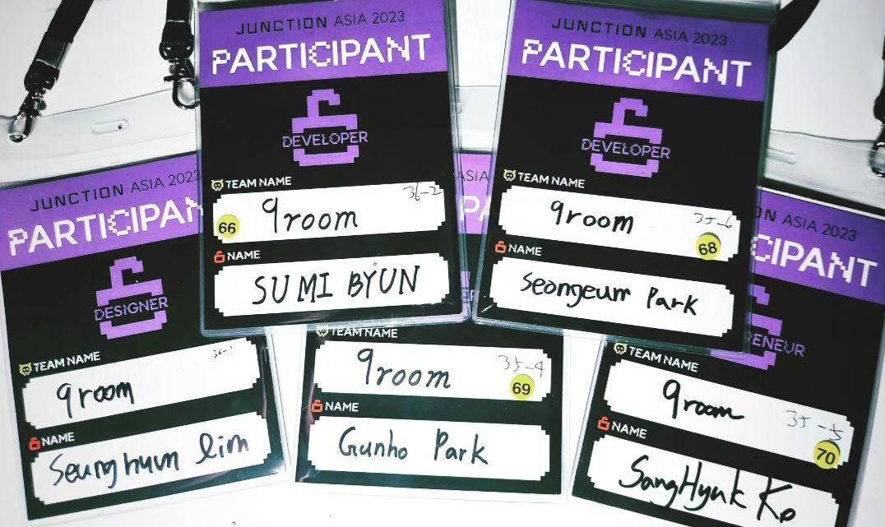

# Junction Asia 2023 `9room` team

### Waste Management Matching Service

#### Introduction

Our service is dedicated to connecting businesses and individuals with waste management companies that suit their specific needs. With growing concerns about the environment, it's crucial now more than ever to ensure that waste is disposed of correctly. Our platform makes this process simple, efficient, and environmentally friendly.

 

### Team Members

**Designer:**  
- **SengEun Park**

**Frontend Developers:**  

- **SuMi Byun**
- **SeungHyun Lim**

**Backend Developer:**  
- **GunHo Park**

**Planner:**  
- **SangHyuk Ko**

 

## Features

- Intuitive user interface for easy navigation.
- A comprehensive database of waste management companies.
- Matchmaking algorithm to find the best fit for users.
- Real-time communication tools for users and service providers.
- Reviews and ratings to ensure transparency and trust.

 

## Getting Started

1. Sign up on our platform.
2. Input your specific waste disposal needs.
3. Get matched with a suitable waste management company.
4. Arrange a pick-up or drop-off time.
5. Leave a review and help others make informed decisions!

---
